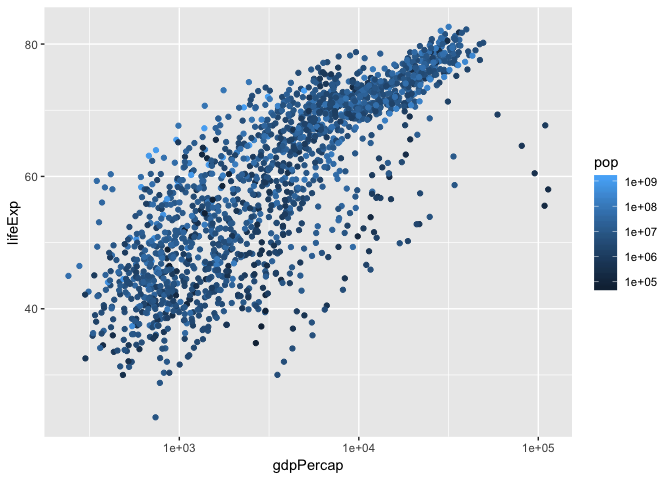
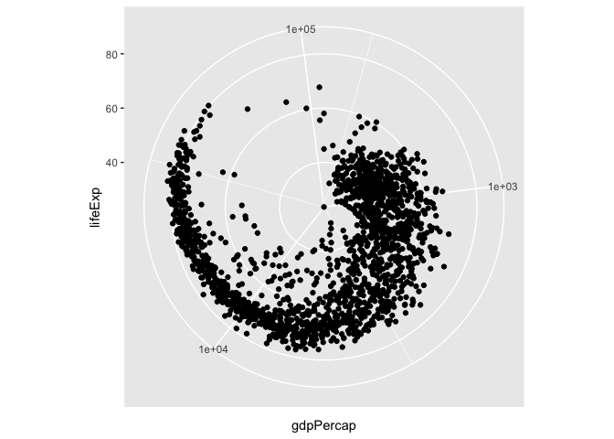

cm007 Exercises: Exploring Aesthetic Mappings
================

Beyond the x and y aesthetics
=============================

Switch focus to exploring aesthetic mappings, instead of geoms.

``` r
library(gapminder)
library(tidyverse)
```

    ## ── Attaching packages ────────────────────────────────────────────────────── tidyverse 1.2.1 ──

    ## ✔ ggplot2 3.0.0     ✔ purrr   0.2.5
    ## ✔ tibble  1.4.2     ✔ dplyr   0.7.6
    ## ✔ tidyr   0.8.1     ✔ stringr 1.3.1
    ## ✔ readr   1.1.1     ✔ forcats 0.3.0

    ## ── Conflicts ───────────────────────────────────────────────────────── tidyverse_conflicts() ──
    ## ✖ dplyr::filter() masks stats::filter()
    ## ✖ dplyr::lag()    masks stats::lag()

Shapes
------

-   Try a scatterplot of `gdpPercap` vs `pop` with a categorical variable (continent) as `shape`.

``` r
gvsl<-ggplot(gapminder,aes(gdpPercap,lifeExp)) + scale_x_log10()
gvsl+geom_point(aes(shape=continent),alpha=0.2)
```


``` r
gvsl+geom_point(shape="$")
```


-   As with all (?) aesthetics, we can also have them *not* as aesthetics!
    -   Try some shapes: first as integer from 0-24, then as keyboard characters.
    -   What's up with `pch`?

``` r
gvsl+geom_point(shape=7)
```


``` r
gvsl+geom_point(pch=7)
```


List of shapes can be found [at the bottom of the `scale_shape` documentation](https://ggplot2.tidyverse.org/reference/scale_shape.html).

Colour
------

Make a scatterplot. Then:

-   Try colour as categorical variable.

``` r
gvsl+geom_point(aes(colour=continent))
```


``` r
gvsl+geom_point(aes(color=continent))
```


-   Try `colour` and `color`.

-   Try colour as numeric variable.
    -   Try `trans="log10"` for log scale.

``` r
gvsl+geom_point(aes(color=pop))+scale_color_continuous(trans="log10")
```



``` r
gvsl+geom_point(aes(color=lifeExp>60))
```


Make a line plot of `gdpPercap` over time for all countries. Colour by `lifeExp > 60` (remember that `lifeExp` looks bimodal?)

Try adding colour to a histogram. How is this different?

``` r
ggplot(gapminder,aes(lifeExp)) + geom_histogram(aes(color=continent))
```

    ## `stat_bin()` using `bins = 30`. Pick better value with `binwidth`.


``` r
ggplot(gapminder,aes(lifeExp)) + geom_histogram(aes(fill=continent))
```

    ## `stat_bin()` using `bins = 30`. Pick better value with `binwidth`.


Facetting
---------

Make histograms of `gdpPercap` for each continent. Try the `scales` and `ncol` arguments. \#free\_x: free x axis, not the same for every graph

``` r
ggplot(gapminder,aes(lifeExp))+
  facet_wrap(~continent,scales="free_x")+
  geom_histogram()
```

    ## `stat_bin()` using `bins = 30`. Pick better value with `binwidth`.


Remove Oceania. Add another variable: `lifeExp > 60`.

``` r
ggplot(gapminder,aes(gdpPercap))+
  facet_grid(continent~lifeExp>60)+
  geom_histogram()
```

    ## `stat_bin()` using `bins = 30`. Pick better value with `binwidth`.


Bubble Plots
------------

-   Add a `size` aesthetic to a scatterplot. What about `cex`?

``` r
gvsl+geom_point(aes(size=pop),alpha=0.2)
```


``` r
gvsl+geom_point(aes(size=pop),alpha=0.2)+
  scale_size_area()
```


-   Try adding `scale_radius()` and `scale_size_area()`. What's better?

-   Use `shape=21` to distinguish between `fill` (interior) and `colour` (exterior).

``` r
gvsl+geom_point(aes(size=pop,fill=continent),shape=21,color="black",alpha=0.2)
```


"Complete" plot
---------------

Let's try plotting much of the data.

-   gdpPercap vs lifeExp with pop bubbles

``` r
gvsl+geom_point(aes(size=pop,color=continent))+
  scale_size_area()+
  facet_wrap(~year)
```


-   facet by year

-   colour by continent

Continue from last time (geom exploration with `x` and `y` aesthetics)
======================================================================

Path plots
----------

Let's see how Rwanda's life expectancy and GDP per capita have evolved over time, using a path plot.

-   Try `geom_line()`. Try `geom_point()`.

``` r
summary(gapminder)
```

    ##         country        continent        year         lifeExp     
    ##  Afghanistan:  12   Africa  :624   Min.   :1952   Min.   :23.60  
    ##  Albania    :  12   Americas:300   1st Qu.:1966   1st Qu.:48.20  
    ##  Algeria    :  12   Asia    :396   Median :1980   Median :60.71  
    ##  Angola     :  12   Europe  :360   Mean   :1980   Mean   :59.47  
    ##  Argentina  :  12   Oceania : 24   3rd Qu.:1993   3rd Qu.:70.85  
    ##  Australia  :  12                  Max.   :2007   Max.   :82.60  
    ##  (Other)    :1632                                                
    ##       pop              gdpPercap       
    ##  Min.   :6.001e+04   Min.   :   241.2  
    ##  1st Qu.:2.794e+06   1st Qu.:  1202.1  
    ##  Median :7.024e+06   Median :  3531.8  
    ##  Mean   :2.960e+07   Mean   :  7215.3  
    ##  3rd Qu.:1.959e+07   3rd Qu.:  9325.5  
    ##  Max.   :1.319e+09   Max.   :113523.1  
    ## 

``` r
gapminder %>% 
  filter(country=="Rwanda") %>% 
  arrange(year) %>% 
  ggplot(aes(gdpPercap,lifeExp))+
  #scale_x_log10+
  geom_point()+
  #geom_line()
  geom_path(arrow=arrow())
```


-   Add `arrow=arrow()` option.

-   Add `geom_text`, with year label.

Two categorical variables
-------------------------

Try `cyl` (number of cylinders) ~ `am` (transmission) in the `mtcars` data frame.

-   Scatterplot? Jitterplot? No.

``` r
ggplot(mtcars,aes(factor(cyl),factor(am)))+
  #geom_point()+
  #geom_jitter()+
 # geom_count()+
  geom_bin2d()
```


``` r
  #for heat map, gene expression
```

-   `geom_count()`.

-   `geom_bin2d()`. Compare with `geom_tile()` with `fill` aes.

Overplotting
------------

Try a scatterplot with:

-   Alpha transparency.
-   `geom_hex()`
-   `geom_density2d()`
-   `geom_smooth()`

``` r
gvsl+geom_hex()
```


``` r
gvsl+geom_density2d()
```


``` r
gvsl+geom_point(alpha=0.1)+geom_smooth(method="lm")
```


Bar plots
---------

How many countries are in each continent? Use the year 2007.

1.  After filtering the gapminder data to 2007, make a bar chart of the number of countries in each continent. Store everything except the geom in the variable `d`.

``` r
gapminder %>% 
  filter(year==2007) %>% 
  ggplot(aes(x=continent))+
  geom_bar()
```


1.  Notice the y-axis. Oddly, `ggplot2` doesn't make it obvious how to change to proportion. Try adding a `y` aesthetic: `y=..count../sum(..count..)`.

**Uses of bar plots**: Get a sense of relative quantities of categories, or see the probability mass function of a categorical random variable.

Polar coordinates
-----------------

-   Add `coord_polar()` to a scatterplot.

``` r
gvsl+geom_point()+coord_polar()
```



``` r
#geological data, distance from the center
```

Want more practice?
===================

If you'd like some practice, give these exercises a try

**Exercise 1**: Make a plot of `year` (x) vs `lifeExp` (y), with points coloured by continent. Then, to that same plot, fit a straight regression line to each continent, without the error bars. If you can, try piping the data frame into the `ggplot` function.

**Exercise 2**: Repeat Exercise 1, but switch the *regression line* and *geom\_point* layers. How is this plot different from that of Exercise 1?

**Exercise 3**: Omit the `geom_point` layer from either of the above two plots (it doesn't matter which). Does the line still show up, even though the data aren't shown? Why or why not?

**Exercise 4**: Make a plot of `year` (x) vs `lifeExp` (y), facetted by continent. Then, fit a smoother through the data for each continent, without the error bars. Choose a span that you feel is appropriate.

**Exercise 5**: Plot the population over time (year) using lines, so that each country has its own line. Colour by `gdpPercap`. Add alpha transparency to your liking.

**Exercise 6**: Add points to the plot in Exercise 5.
